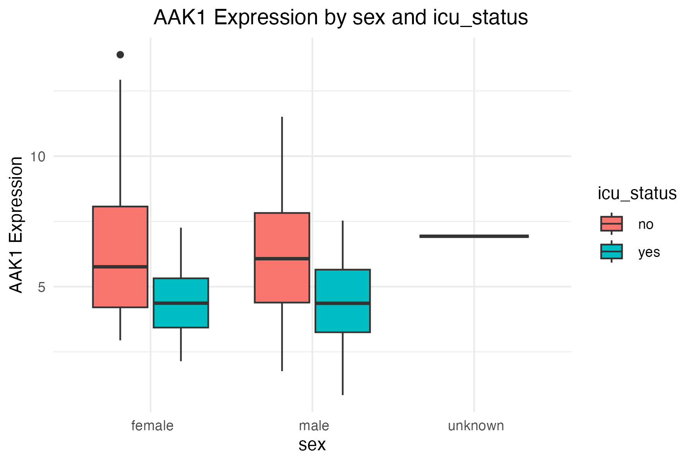
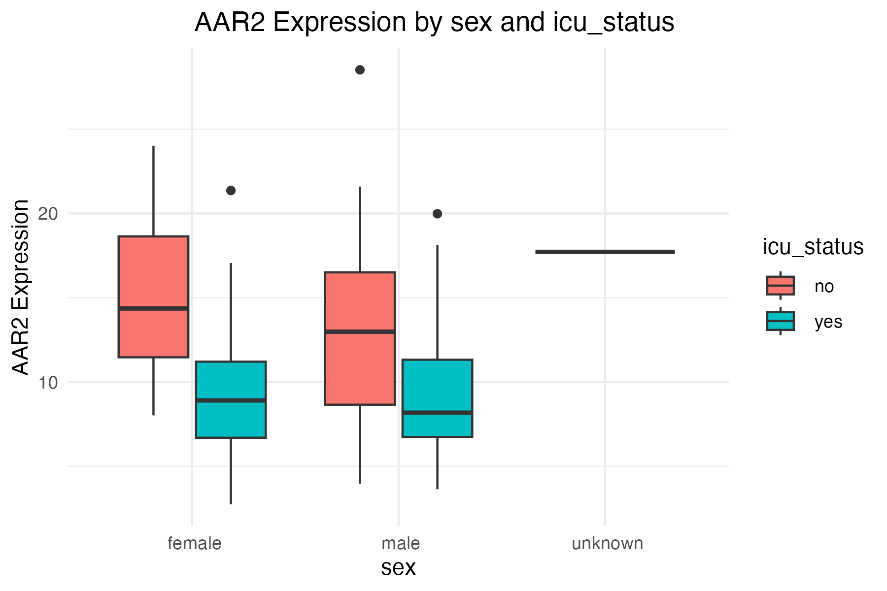
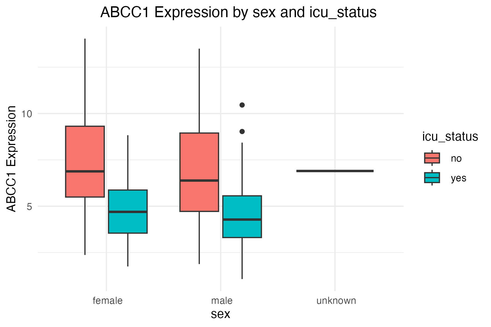

Install packages & read data & local setting
```{r}
library(tidyverse)
#set path
setwd('/Users/stanpawn/Desktop/Data science 101/Submission 1')
#read data
metadata <- read.csv("QBS103_GSE157103_series_matrix-1.csv")
gene_exp_raw <- read.csv("QBS103_GSE157103_genes.csv")
#check data
glimpse(metadata)
glimpse(gene_exp_raw)

```
Work with the gene expression data
```{r}
#working with rows & columns
gene_exp_t <- gene_exp_raw %>%
  column_to_rownames(var = "X") %>% #change the 1st columnname to rowname
  t() %>% #transpose the data frame
  as.data.frame()

gene_exp_t <- gene_exp_t %>%
  rownames_to_column(var="participant_id")

glimpse(gene_exp_t)

#combine gene expression & metadata
#common samples ID
common_ids <- intersect(metadata$participant_id, gene_exp_t$participant_id)
#filter data using these IDs
metadata_clean <- metadata %>% filter(participant_id %in% common_ids)
gene_expr_clean <- gene_exp_t %>% filter(participant_id %in% common_ids)

full_data <- left_join(metadata, gene_exp_t, by = "participant_id")
glimpse(full_data)
```
Choose variables
```{r}
#check number of rows before start
nrow(full_data) == nrow(metadata)

#check variables
names(full_data)
'AAK1' %in% colnames(full_data)
summary(full_data$AAK1)
# change ferritin from char to num
full_data <- full_data %>%
  mutate(ferritin = as.numeric(`ferritin.ng.ml.`))

summary(full_data$ferritin)
summary(full_data$AAK1)
summary(full_data$ferritin.ng.ml.)


#check distribution of categorical covarities
table(full_data$sex, useNA = "always")
table(full_data$icu_status, useNA = "always")
```
Graphs
```{r}
#Histogram of AKK1 expression
ggplot(full_data, aes(x=AAK1))+
  geom_histogram(binwidth = 0.5, fill = 'steelblue', color = 'white', na.rm = TRUE) +
  labs(
    title = "Histogram of AAK1 Gene Expression",
    x = "AAK1 Expression Level",
    y = "Number of Samples"
  ) +
  theme_minimal()

#Scattor plots of AKK1 and Ferritin
ggplot(full_data, aes(x=ferritin, y=AAK1, color=icu_status)) +
  geom_point(alpha = 0.7) +
  labs(
    title = "Scatterplot: AAK1 Expression vs. Ferritin Level",
    x = "Ferritin (ng/ml)",
    y = "AAK1 expression"
  ) +
  theme_minimal()
#Boxplot of AAK1 by Sex and ICU status
ggplot(full_data, aes(x = sex, y = AAK1, fill = icu_status)) +
  geom_boxplot() +
  labs(title = "AAK1 Expression by Sex and ICU Status",
       x = "Sex",
       y = "AAK1 Expression") +
  theme_minimal()
```


submission2 continue:
```{r}
library(ggplot2) #import funtion
#generate gene plot
make_gene_plot <- function(df, gene, xvar, cat1, cat2) {
  df <- na.omit(df[, c(gene, cat1, cat2)])  #ignoring the warning of NA value
  ggplot(df, aes_string(x = cat1, y = gene, fill = cat2)) +
    geom_boxplot() +
    labs(
      title = paste(gene, "Expression by", cat1, "and", cat2),
      x = cat1,
      y = paste(gene, "Expression"),
      fill = cat2
    ) +
    theme_minimal()
}
make_gene_plot(full_data, "AAK1", "ferritin", "sex", "icu_status")
```
Use for loop to generate 3 different gene plots
```{r} 
genes <- c("AAK1", "AAR2", "ABCC1")

make_gene_plot <- function(df, gene, xvar, cat1, cat2) {
  df <- na.omit(df[, c(gene, cat1, cat2)])
  ggplot(df, aes_string(x = cat1, y = gene, fill = cat2)) +
    geom_boxplot() +
    labs(
      title = paste(gene, "Expression by", cat1, "and", cat2),
      x = cat1,
      y = paste(gene, "Expression"),
      fill = cat2
    ) +
    theme_minimal() +
    theme(plot.title = element_text(hjust = 0.7))
}

for (g in genes) {
  print(make_gene_plot(full_data, g, "ferritin.ng.ml.", "sex", "icu_status"))
}
```
Saving plots
```{r} 
for (g in genes) {
  p <- make_gene_plot(full_data, g, "ferritin.ng.ml.", "sex", "icu_status")
  ggsave(filename = paste0(g, "_boxplot.png"), plot = p, width = 6, height = 4)
}
```
AAK1 Boxplot


AAR2 Boxplot


ABCC1 Boxplot


